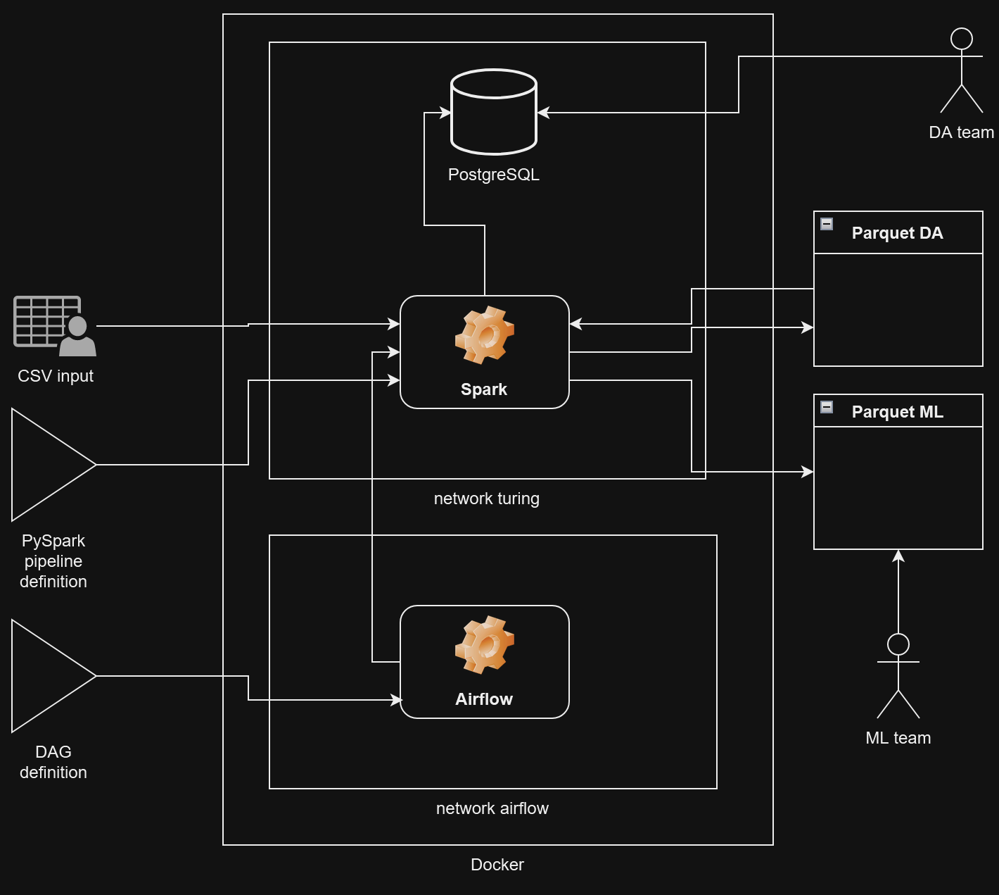
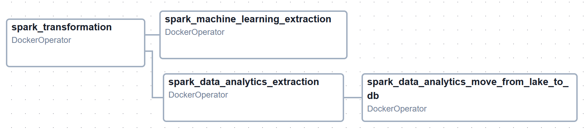

### Portfolio project
# Big Data Fundamentals project: Smart Meters

This is repository for Turing College Data Engineering course Module 4D Sprint 2 - Big Data Fundamentals by Jakub Kluz. It is an iteration on Sprint 1, that was about transforming [the source dataset from Kaggle](https://www.kaggle.com/datasets/jeanmidev/smart-meters-in-london) with Spark using PySpark interface. Spark jobs were executed as Docker containers and data requirements for two teams, Machine Learning and Data Analytics, were rather complex but met 100%.

The purpose of this project is to iterate on the Big Data architecture and techniques, adjusting to changing requirements and introducing new ideas. Important changes from the previous project is the usage of Airflow, using half-hourly data to make the data more complete. The dataset has WAY more columns now.

## Rationale
The description of thought process and reasoning behind this code is available for an avid person in [separate file](doc/REASONING.md).

# Environment
I am developing on GNU/Linux Ubuntu 22.04 Server Edition using Oracle Free Tier ARM64 machine VM.Standard.A1.Flex with 4 ARM cores and 24 GB of RAM. The machine is working beautifuly for me for the whole Turing College course. Some other parts of my environment include:

* Docker 24.05 from the Ubuntu repository along with Docker Compose 1.29.2 as a plugin (not yet integrated into Docker - it has happened in the following versions),
* Apache Airflow from DockerHub, image `apache/airflow:2.9.0`
* Spark 3.5.1 from Docker Hub, image `spark:python3`,
* PostgreSQL 16.2 from Docker Hub, image `postgres:16.2`,
* DataGrip 2023.3.1 from JetBrains. What a relief it is to work with a proper quality database-centric and user-friendly (I am looking at you, Adminer!) environment. If only there would be support for dbt, it would be bananas, however it will likely never happen - it is conceptually very different.

I am developing with Visual Studio Code with Remote SSH connection to the Oracle machine.

# How to run this project?
1. First, you need to grab the data from [the source dataset at Kaggle](https://www.kaggle.com/datasets/jeanmidev/smart-meters-in-london). Unpack the files to `data/input` directory.
2. Second, you need to grab a JDBC PostgreSQL driver as a `.jar` file from [here](https://jdbc.postgresql.org/download/). Put it in the root foler of this repository. *Suprisingly, Spark image does not come with this by default, which is a flaw in it's completeness.*
3. Make `data/output` publicly writable for Spark container to write with `chmod 777 data/output`.
4. Adjust `src/constants.py` Python script to match your environment.
5. Create Docker network with `docker network create turing`.
6. Run the PostgreSQL database as a Docker container attached to `turing` network.
7. Launch Apache Airflow stack using `docker/airflow` config files. Follow the official [documentation](https://airflow.apache.org/docs/apache-airflow/stable/howto/docker-compose/index.html).
8. Add details of your PostgreSQL database to Airflow Connections metastore.
9. Adjust settings for Airflow DAGs in `dags` folder. Look for paths in mountpoints and alter sources. Set the processing date to your needs, keep the format "YYYY-MM-DD". Replace with Airflow templating if that is your idea.
10. Run DAGs with tag `jakluz-de4d.2.5`. It will take a while to finish.
11. Inspect the results.

## Results
Data Analyst sample parquet file summary:
```
 # Metadata
 <pyarrow._parquet.FileMetaData object at 0xfa81724af100>
  created_by: parquet-mr version 1.13.1 (build db4183109d5b734ec5930d870cdae161e408ddba)
  num_columns: 56
  num_rows: 5343
  num_row_groups: 1
  format_version: 1.0
  serialized_size: 10925
```

Data Analyst parquet file scheme:
```
 # Schema
 <pyarrow._parquet.ParquetSchema object at 0xea2afc35ae80>
required group field_id=-1 spark_schema {
  optional binary field_id=-1 lclid (String);
  optional binary field_id=-1 tariff (String);
  optional binary field_id=-1 acorn_group (String);
  optional binary field_id=-1 acorn_group_high_level (String);
  optional int32 field_id=-1 week_no;
  optional int32 field_id=-1 month_no;
  required boolean field_id=-1 bank_holidays;
  required boolean field_id=-1 weekend;
  optional double field_id=-1 hh_0;
  optional double field_id=-1 hh_1;
  optional double field_id=-1 hh_2;
  optional double field_id=-1 hh_3;
  optional double field_id=-1 hh_4;
  optional double field_id=-1 hh_5;
  optional double field_id=-1 hh_6;
  optional double field_id=-1 hh_7;
  optional double field_id=-1 hh_8;
  optional double field_id=-1 hh_9;
  optional double field_id=-1 hh_10;
  optional double field_id=-1 hh_11;
  optional double field_id=-1 hh_12;
  optional double field_id=-1 hh_13;
  optional double field_id=-1 hh_14;
  optional double field_id=-1 hh_15;
  optional double field_id=-1 hh_16;
  optional double field_id=-1 hh_17;
  optional double field_id=-1 hh_18;
  optional double field_id=-1 hh_19;
  optional double field_id=-1 hh_20;
  optional double field_id=-1 hh_21;
  optional double field_id=-1 hh_22;
  optional double field_id=-1 hh_23;
  optional double field_id=-1 hh_24;
  optional double field_id=-1 hh_25;
  optional double field_id=-1 hh_26;
  optional double field_id=-1 hh_27;
  optional double field_id=-1 hh_28;
  optional double field_id=-1 hh_29;
  optional double field_id=-1 hh_30;
  optional double field_id=-1 hh_31;
  optional double field_id=-1 hh_32;
  optional double field_id=-1 hh_33;
  optional double field_id=-1 hh_34;
  optional double field_id=-1 hh_35;
  optional double field_id=-1 hh_36;
  optional double field_id=-1 hh_37;
  optional double field_id=-1 hh_38;
  optional double field_id=-1 hh_39;
  optional double field_id=-1 hh_40;
  optional double field_id=-1 hh_41;
  optional double field_id=-1 hh_42;
  optional double field_id=-1 hh_43;
  optional double field_id=-1 hh_44;
  optional double field_id=-1 hh_45;
  optional double field_id=-1 hh_46;
  optional double field_id=-1 hh_47;
}
```

Data Engineering PostgreSQL table definition:
```
-- auto-generated definition
create table analytics
(
    lclid                  text,
    tariff                 text,
    acorn_group            text,
    acorn_group_high_level text,
    week_no                integer,
    month_no               integer,
    bank_holidays          boolean,
    weekend                boolean,
    hh_0                   double precision,
    hh_1                   double precision,
    hh_2                   double precision,
    hh_3                   double precision,
    hh_4                   double precision,
    hh_5                   double precision,
    hh_6                   double precision,
    hh_7                   double precision,
    hh_8                   double precision,
    hh_9                   double precision,
    hh_10                  double precision,
    hh_11                  double precision,
    hh_12                  double precision,
    hh_13                  double precision,
    hh_14                  double precision,
    hh_15                  double precision,
    hh_16                  double precision,
    hh_17                  double precision,
    hh_18                  double precision,
    hh_19                  double precision,
    hh_20                  double precision,
    hh_21                  double precision,
    hh_22                  double precision,
    hh_23                  double precision,
    hh_24                  double precision,
    hh_25                  double precision,
    hh_26                  double precision,
    hh_27                  double precision,
    hh_28                  double precision,
    hh_29                  double precision,
    hh_30                  double precision,
    hh_31                  double precision,
    hh_32                  double precision,
    hh_33                  double precision,
    hh_34                  double precision,
    hh_35                  double precision,
    hh_36                  double precision,
    hh_37                  double precision,
    hh_38                  double precision,
    hh_39                  double precision,
    hh_40                  double precision,
    hh_41                  double precision,
    hh_42                  double precision,
    hh_43                  double precision,
    hh_44                  double precision,
    hh_45                  double precision,
    hh_46                  double precision,
    hh_47                  double precision,
    date                   date
);
```

Machine Learning sample parquet file summary:
```
 # Metadata
 <pyarrow._parquet.FileMetaData object at 0xfaffc06cd850>
  created_by: parquet-mr version 1.13.1 (build db4183109d5b734ec5930d870cdae161e408ddba)
  num_columns: 137
  num_rows: 5343
  num_row_groups: 1
  format_version: 1.0
  serialized_size: 23795
```

Machine Learning sample parquet file schema:
```
 # Schema
 <pyarrow._parquet.ParquetSchema object at 0xe34c16b65d80>
required group field_id=-1 spark_schema {
  optional binary field_id=-1 lclid (String);
  optional binary field_id=-1 tariff (String);
  optional binary field_id=-1 acorn_group (String);
  optional binary field_id=-1 acorn_group_high_level (String);
  optional boolean field_id=-1 bank_holidays;
  optional boolean field_id=-1 weekend;
  optional int32 field_id=-1 day (Date);
  optional double field_id=-1 temp_max;
  optional double field_id=-1 temp_min;
  optional double field_id=-1 temp_mean;
  optional double field_id=-1 temp_median;
  optional double field_id=-1 wind_speed_max;
  optional double field_id=-1 wind_speed_min;
  optional double field_id=-1 wind_speed_mean;
  optional double field_id=-1 wind_speed_median;
  optional boolean field_id=-1 rain;
  optional boolean field_id=-1 snow;
  optional boolean field_id=-1 partly-cloudy-night;
  optional boolean field_id=-1 partly-cloudy-day;
  optional boolean field_id=-1 fog;
  optional boolean field_id=-1 cloudy;
  optional boolean field_id=-1 clear-night;
  optional double field_id=-1 hh_0;
  optional double field_id=-1 hh_1;
  optional double field_id=-1 hh_2;
  optional double field_id=-1 hh_3;
  optional double field_id=-1 hh_4;
  optional double field_id=-1 hh_5;
  optional double field_id=-1 hh_6;
  optional double field_id=-1 hh_7;
  optional double field_id=-1 hh_8;
  optional double field_id=-1 hh_9;
  optional double field_id=-1 hh_10;
  optional double field_id=-1 hh_11;
  optional double field_id=-1 hh_12;
  optional double field_id=-1 hh_13;
  optional double field_id=-1 hh_14;
  optional double field_id=-1 hh_15;
  optional double field_id=-1 hh_16;
  optional double field_id=-1 hh_17;
  optional double field_id=-1 hh_18;
  optional double field_id=-1 hh_19;
  optional double field_id=-1 hh_20;
  optional double field_id=-1 hh_21;
  optional double field_id=-1 hh_22;
  optional double field_id=-1 hh_23;
  optional double field_id=-1 hh_24;
  optional double field_id=-1 hh_25;
  optional double field_id=-1 hh_26;
  optional double field_id=-1 hh_27;
  optional double field_id=-1 hh_28;
  optional double field_id=-1 hh_29;
  optional double field_id=-1 hh_30;
  optional double field_id=-1 hh_31;
  optional double field_id=-1 hh_32;
  optional double field_id=-1 hh_33;
  optional double field_id=-1 hh_34;
  optional double field_id=-1 hh_35;
  optional double field_id=-1 hh_36;
  optional double field_id=-1 hh_37;
  optional double field_id=-1 hh_38;
  optional double field_id=-1 hh_39;
  optional double field_id=-1 hh_40;
  optional double field_id=-1 hh_41;
  optional double field_id=-1 hh_42;
  optional double field_id=-1 hh_43;
  optional double field_id=-1 hh_44;
  optional double field_id=-1 hh_45;
  optional double field_id=-1 hh_46;
  optional double field_id=-1 hh_47;
  optional double field_id=-1 hh_0_tm1;
  optional double field_id=-1 hh_1_tm1;
  optional double field_id=-1 hh_2_tm1;
  optional double field_id=-1 hh_3_tm1;
  optional double field_id=-1 hh_4_tm1;
  optional double field_id=-1 hh_5_tm1;
  optional double field_id=-1 hh_6_tm1;
  optional double field_id=-1 hh_7_tm1;
  optional double field_id=-1 hh_8_tm1;
  optional double field_id=-1 hh_9_tm1;
  optional double field_id=-1 hh_10_tm1;
  optional double field_id=-1 hh_11_tm1;
  optional double field_id=-1 hh_12_tm1;
  optional double field_id=-1 hh_13_tm1;
  optional double field_id=-1 hh_14_tm1;
  optional double field_id=-1 hh_15_tm1;
  optional double field_id=-1 hh_16_tm1;
  optional double field_id=-1 hh_17_tm1;
  optional double field_id=-1 hh_18_tm1;
  optional double field_id=-1 hh_19_tm1;
  optional double field_id=-1 hh_20_tm1;
  optional double field_id=-1 hh_21_tm1;
  optional double field_id=-1 hh_22_tm1;
  optional double field_id=-1 hh_23_tm1;
  optional double field_id=-1 hh_24_tm1;
  optional double field_id=-1 hh_25_tm1;
  optional double field_id=-1 hh_26_tm1;
  optional double field_id=-1 hh_27_tm1;
  optional double field_id=-1 hh_28_tm1;
  optional double field_id=-1 hh_29_tm1;
  optional double field_id=-1 hh_30_tm1;
  optional double field_id=-1 hh_31_tm1;
  optional double field_id=-1 hh_32_tm1;
  optional double field_id=-1 hh_33_tm1;
  optional double field_id=-1 hh_34_tm1;
  optional double field_id=-1 hh_35_tm1;
  optional double field_id=-1 hh_36_tm1;
  optional double field_id=-1 hh_37_tm1;
  optional double field_id=-1 hh_38_tm1;
  optional double field_id=-1 hh_39_tm1;
  optional double field_id=-1 hh_40_tm1;
  optional double field_id=-1 hh_41_tm1;
  optional double field_id=-1 hh_42_tm1;
  optional double field_id=-1 hh_43_tm1;
  optional double field_id=-1 hh_44_tm1;
  optional double field_id=-1 hh_45_tm1;
  optional double field_id=-1 hh_46_tm1;
  optional double field_id=-1 hh_47_tm1;
  required boolean field_id=-1 ACORN-O;
  required boolean field_id=-1 ACORN-I;
  required boolean field_id=-1 ACORN-N;
  required boolean field_id=-1 ACORN-;
  required boolean field_id=-1 ACORN-K;
  required boolean field_id=-1 ACORN-H;
  required boolean field_id=-1 ACORN-U;
  required boolean field_id=-1 ACORN-F;
  required boolean field_id=-1 ACORN-M;
  required boolean field_id=-1 ACORN-P;
  required boolean field_id=-1 ACORN-G;
  required boolean field_id=-1 ACORN-B;
  required boolean field_id=-1 ACORN-E;
  required boolean field_id=-1 ACORN-A;
  required boolean field_id=-1 ACORN-J;
  required boolean field_id=-1 ACORN-D;
  required boolean field_id=-1 ACORN-C;
  required boolean field_id=-1 ACORN-Q;
  required boolean field_id=-1 ACORN-L;
}
```

Architecture:



Dag structure:


