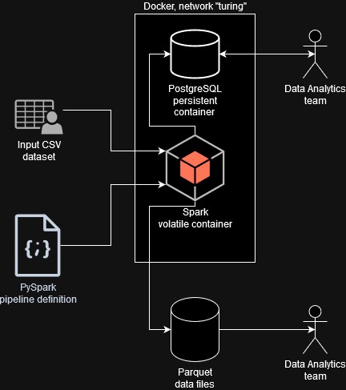

# Looking for a solution
The requirements are rather strict. I have two main data user groups, the Machine Learning team and the Data Analytics team, that I have to support with a data they need in format they need.

# Evaluating technologies
## User Group 1: the Machine Learning team
**The ML team needs to have the data stored in files, that mimic their local development environment and is suitable for batch processing to run machine learning algorithms for those.**

If not for the files requirement, I think I would go with RDBMS that supports JSON data type (like PostgreSQL) or even a NoSQL solution like MongoDB. Probably I could even expose the database JSON with WebDAV or similar technology and mount it to the filesystem, but that looks like an overengineering. I could stick to the old and trusty JSON file format. The JSON file format is suitable for usage with plain Python (the `json` package in standard library), Pandas (`pandas.read_json` method) and scikit-learn (with Pandas help, as in [the scikit-learn documentation](https://scikit-learn.org/stable/datasets/loading_other_datasets.html#loading-from-external-datasets)). It also provides the nested structure, that ML team intends to use. The issue with JSON is that it's not compressed or disk-space optimized by all means. And since I don't have that much space on my work machine, I might be better of looking for an alternative.

SQLite could also be a very good option. The nested requirement would be easily satisfied by SQLite JSON data type and relevant tooling. However, having SQLite as a Data Lake does not feel like the proper usage for SQLite, so I decided to stick with more Big Data-focused technologies.

The S3-style buckets would be very good solution as well, but those do not satisfy the local files requirements.

Apache Parquet could also be an option, probably much more compact. In previous versions of Spark, nested data structures in Parquet files [were problematic](https://stackoverflow.com/questions/49474814/what-is-the-benefit-of-using-nested-data-types-in-parquet), but nowe everything looks much smoother. The Parquet has a nice option to use it as a source file in PostgreSQL (Parquet file could be read directly by PostgreSQL and available for SQL query as a table) as per [this blog post](https://www.crunchydata.com/blog/parquet-and-postgres-in-the-data-lake) with a minimal speed cost. This is a nice improvement, that could possibly limit my load part of the data pipeline to just one place (the Parquet file), and then make PostgreSQL read it as-is. Parquet is supported in plain Python with either `pyarrow` package or slightly dated `parquet` package, in Pandas with `read_parquet` method, and in scikit-learn with Pandas as a middleman.

However, the data for both teams is not identical - it overlaps by a large amount, but not identical. I could read the data from Parquet into PostgreSQL and manage the differences with materialized view, but that would require the PostgreSQL and Parquet files to stay on the same machine - if I would read those from a network share, the performance would be probably much worse, especialy if the database would not have high speed connection to the network share (separate datacentres). So, while reading Parquet from PostgreSQL might indeed be good idea, for the sake of performance and portability I decided to maintain the two datasets for the teams separately.

## User Group 2: the Data Analytics team
**The Data Analytics team needs the data in a format, that is suitable for reading with a dashboard.**

Let's assume, that dashboard would be created with Microsoft PowerBI, which is quite a realistic assumption. Let's also assume, that the dashboard will be available as a part of managed PowerBI platform rather than the desktop version.

This already gives me some limitations. While the PowerBI could work with Parquet files, those would need to be exposed in local filesystem (not relevant in managed platform) or one of Azure solutions as per the [connector docs](https://learn.microsoft.com/en-us/power-query/connectors/parquet). Since I don't want to feed the Azure cloud with my data, I need some other solution, that will provide the dashboard with data.

I would be much better off with using RDBMS, that would let PowerBI query the dataset over network with a [fairly mature and PowerBI-native tools](https://learn.microsoft.com/pl-pl/power-query/connectors/postgresql). It makes PostgreSQL a strong choice. While I would love to go with a proper OLAP RDBMS like ClickHouse, it's support in PowerBI does not seem to have the level of maturity PostgreSQL does.

I could also consider a document-oriented NoSQL database like MongoDB. It could be much faster, but it would not meet the expectations to query the data with SQL.

Other option would be using Hive and the Hadoop ecosystem, but since those queries needs quick reads (low latencies), the massive overhead from it's distributed nature and high latencies from Hive and HDFS is not an option.

# Technology stack
After the initial reasoning, the tech stack will consist of:
- **Docker** as a container management system/isolation layer. Every part of the technological stack will be run in Docker.
- **Apache Spark** as an (E)TL stack. I will make all the transformations in Spark. Data is downloaded manually from Kaggle, so the E part is already almost done. Spark will still read the data from the filesystem in Spark of course.
- **PySpark** as a way to harness Spark with a familar Python syntax. Let's note, that using Scala (the language that Spark is developed in) would potentially be more performant, but I don't know Scala well enough to use it. Let's also note, that Python version bundled in official Spark Docker container is 3.8.10, which is quite old and the image base is Ubuntu 20.04.06. Still, I believe all the functionality I seem to need is bundled in PySpark, so that is not going to be an issue.
- **Apache Parquet** will be used to store transformed data on disk. Those files will form a kind of a Data Warehouse storage layer. It's worth noting, that the nested structure as a requirement for this project does not make sense with this dataset. It may however be a part of future-proofing the requirements, when the nested data structures will become important. Still, I believe I would opt for Parquet even with this requirement absent.
- **PostgreSQL** will be used as a data source for data visualization software (which is assumed to be PowerBI from Microsoft), a kind of Data Warehouse presentation layer. It will also provide an SQL interface to query the data.

The architecture diagram looks like this:

## How do I intend user groups would use the data?
### Machine Learning team
They will use the Parquet files with data provided in [data/output](data/output) directly. Those can be shared with an NFS/CIFS share or even SFTP over the network. If not for the local file requirement, an S3-compatible object storage would be just perfect.

### Data Analytics team
They will be able to reach the relevant data with a PostgreSQL.

# Further work
In order to make this solution more sustainable and reliable, much more ready for the production usage, I would change the architecture in the following ways:

1. **Spark cluster** for the dataset of current size, spinning a single Spark node to transform the data is rather quick and convienient. However, it would be much more reliable to have a separate multi-node Spark cluster, that would transform the data. It would be beneficial for the longer run, provided the company wants to use Spark more. If that is just one-shot effort, it's probably not worth the trouble.
2. **Input and output file storage** it would be much more reliable to store the input data in a replicated manner (like using HDFS), or using S3-compatible bucket.
3. **PostgreSQL replication** it would be much more fault-tolerant to have a database replica, if main node would go down.
4. **Backups** both input data, output data, data pipeline scripts and the database needs to be backed up using at least 3-2-1 paradigm.